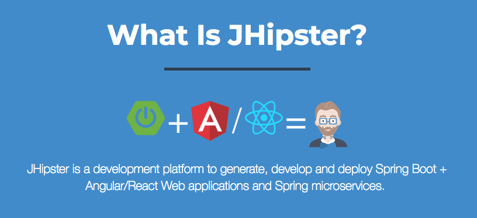

# Java popular tools and libraries

## Microservices tools

### JHipster

***What Is JHipster?***
JHipster is a development platform to generate, develop and deploy Spring Boot + Angular / React / Vue Web applications and Spring microservices.

## Database tools

### Flyway - Migrations Made Easy.
[Version control for your database.](https://flywaydb.org/)
